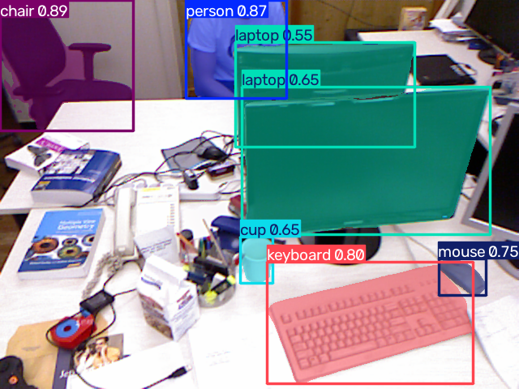
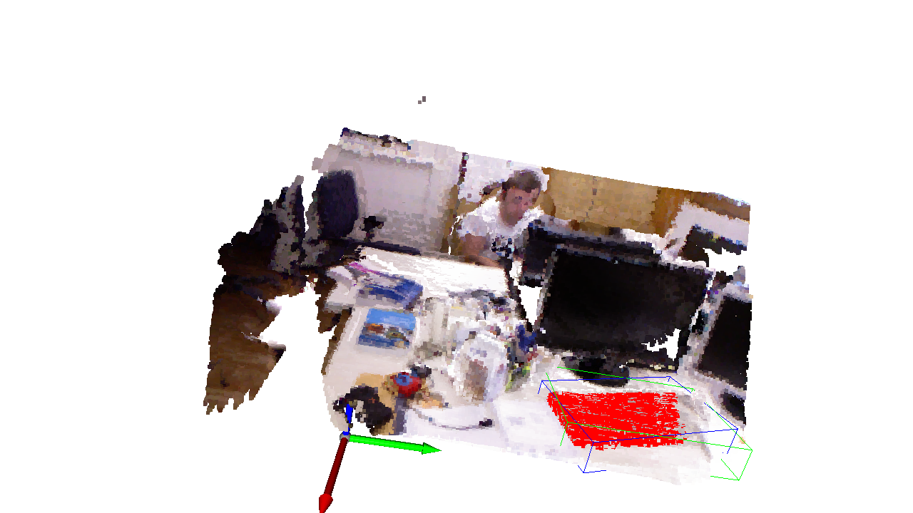

# RGB-D Robot Perception

这是一个面向机器人视觉入门的 RGB-D 三维目标感知项目。项目使用 YOLO26 完成二维实例分割，结合 TUM RGB-D 数据集的深度图和相机位姿，将多帧场景与目标点云变换到统一世界坐标系，最后使用 Open3D 完成点云融合、目标定位和三维包围盒显示。

这个项目也是我学习机器人视觉的实践记录。代码没有直接从完整框架开始，而是按照“二维检测 → RGB-D 读取 → 场景点云 → 目标点云 → 完整三维感知”的顺序逐步实现。四个 `test*.py` 文件保留了每个阶段的学习代码，`main.py` 则是整理后的正式运行入口。

## 项目实现效果

当前程序可以完成以下流程：

- 读取 TUM RGB-D 数据集并匹配时间戳最接近的 RGB 和 Depth 图像
- 根据时间戳匹配相机 groundtruth 位姿
- 使用 YOLO26 对 RGB 图像进行实例分割
- 计算目标中心附近的深度中位数
- 将像素坐标转换为相机坐标系下的三维坐标
- 根据实例分割 Mask 提取目标三维点云
- 对目标点云进行体素降采样和统计滤波
- 使用 DBSCAN 保留目标的最大点云簇
- 将多帧场景和目标点云变换到统一世界坐标系
- 融合 50 帧点云并计算目标三维中心、AABB 和 OBB
- 在 Open3D 中以红色显示目标点云
- 将二维实例分割结果保存到 `outputs/2D/`
- 将 Open3D 三维视图保存到 `outputs/3D/`
- 将处理后的目标点云保存为 `outputs/point/` 中的 PLY 文件

## 学习与编写历程

### 1. 普通相机目标检测

最开始通过 `test_camera.py` 学习 OpenCV 摄像头读取和 YOLO 目标检测，获取目标的二维检测框、类别、置信度以及中心像素坐标。

这一阶段还使用固定深度值练习了针孔相机模型，理解如何通过相机内参将像素坐标 `(u, v)` 转换为相机坐标系中的 `(X, Y, Z)`。

### 2. RGB-D 图像读取与深度估计

在 `test_RGBD.py` 中加入 TUM RGB-D 数据集，分别读取 `rgb.txt` 和 `depth.txt`，再根据时间戳为每张 RGB 图像匹配时间上最接近的深度图。

为了减小单个深度像素噪声的影响，程序没有直接使用目标中心点的深度，而是读取中心附近的 `7 × 7` 区域，去除无效深度后计算中位数。

### 3. 完整场景点云生成

在 `test_pointcloud.py` 中使用 Open3D 将 RGB 图像和深度图组合为 RGB-D 图像，再根据 Freiburg1 相机内参生成完整场景点云。

这一阶段加入了体素降采样，用较少的点保留场景整体结构，降低后续显示和计算的开销。

### 4. 目标三维点云与三维包围盒

在 `test_object_pointcloud.py` 中将 YOLO 检测升级为实例分割。与直接使用二维检测框相比，实例 Mask 能更准确地保留目标区域，减少检测框内背景点对三维结果的影响。

目标点云生成后，依次进行：

1. 体素降采样，减少重复点；
2. 统计滤波，去除离群点；
3. DBSCAN 聚类，保留最大的点云簇；
4. 计算目标点云三维中心；
5. 计算 AABB 和 OBB；
6. 将目标点云染成红色，并与完整场景一起显示。

### 5. 工程化整理

完整流程验证后，将原本集中在 `test_object_pointcloud.py` 中的代码整理为 `main.py + utils` 结构。正式代码按照数据读取、几何计算、点云处理和结果显示划分，同时保留全部测试文件，用于记录功能逐步实现的过程。

### 6. 多帧场景与目标点云融合

在 `muti_frame.py` 中先独立验证多帧场景融合，再加入逐帧实例分割和目标点云融合。验证完成后，将该流程正式整合到 `main.py`。当前默认处理第 `0、2、4 ... 98` 帧，共 50 帧，并利用 TUM groundtruth 位姿将各帧点云转换到统一世界坐标系。

## 处理流程

```text
读取 rgb.txt / depth.txt / groundtruth.txt
          ↓
匹配时间戳最接近的 RGB-D 图像和相机位姿
          ↓
逐帧生成场景点云并转换到世界坐标系
          ↓
YOLO26 实例分割 → Mask 反投影为目标点云
          ↓
目标点云降采样 → 统计滤波 → DBSCAN 最大簇
          ↓
融合多帧场景和目标点云
          ↓
计算融合目标中心、AABB 和 OBB 并保存结果
```

## 实验结果

### 二维实例分割结果

下面是第 0 帧、`target_class = "keyboard"` 时保存的真实输出。YOLO26 检测到键盘后，使用半透明颜色显示对应的实例分割 Mask。正式流程会保存本次处理的每一帧二维结果。



### 三维目标感知结果

程序会在 Open3D 窗口中显示以下内容：

- 原始颜色的完整场景点云；
- 红色的键盘目标点云；
- 绿色的轴对齐包围盒 AABB；
- 蓝色的旋转包围盒 OBB；
- 位于世界坐标系原点的三维坐标轴。

程序启动 Open3D 窗口后，会先将默认视角保存到 `outputs/3D/`。调整观察视角后按 `S`，可以使用当前视角覆盖原截图。



本次 50 帧运行共成功融合 50 帧场景，其中 39 帧检测到键盘；融合目标最终包含 34,466 个点。点云结果保存在 `outputs/point/`，PLY 文件只包含融合后的目标点云，不保存完整场景点云。

### 参数实验

为了观察帧数和体素大小对融合结果的影响，使用 `parameter_experiment.py` 完成了 5 组简单对比。实验均从第 0 帧开始，保持目标类别、相机参数、统计滤波和 DBSCAN 参数不变。表中的 `Voxel Size` 同时用于单帧场景降采样和最终场景融合，目标体素大小保持为该值的一半，与正式程序当前的 `0.01 / 0.005` 参数比例一致。

在项目根目录执行 `python parameter_experiment.py` 可以重新运行实验，程序结束后会在终端输出可直接复制到 Markdown 的结果表格。

运行时间统计图像读取、YOLO 推理、点云生成、滤波、融合和包围盒计算，不包含模型首次加载、结果写入磁盘和 Open3D 窗口等待。时间来自同一台电脑的一次实测，主要用于比较相对变化。

| 帧数 | Frame Step | Voxel Size | 融合后场景点数 | 目标点数 | 运行时间 |
| ---: | ---: | ---: | ---: | ---: | ---: |
| 10 | 2 | 0.010 | 101,580 | 16,229 | 0.85 s |
| 20 | 2 | 0.010 | 114,729 | 18,486 | 1.43 s |
| 50 | 2 | 0.010 | 509,932 | 34,466 | 3.85 s |
| 50 | 2 | 0.005 | 1,946,412 | 188,173 | 8.77 s |
| 50 | 2 | 0.020 | 112,902 | 5,580 | 2.64 s |

**帧数增加：** 在 `Frame Step=2`、`Voxel Size=0.01` 时，处理帧数从 10 增加到 50，场景覆盖范围和目标点数均有所增加，运行时间由 0.85 s 增加到 3.85 s。更多帧能够补充不同视角的信息，但也会增加计算量和重叠区域。

**Voxel Size 增加：** 50 帧条件下，体素大小从 `0.005` 增加到 `0.02` 后，场景点数从 1,946,412 降至 112,902，目标点数从 188,173 降至 5,580，运行时间也随之下降。较大的体素能够显著减少点数并提高处理速度，但会损失目标表面和边缘的几何细节；当前使用的 `0.01` 在点云规模和细节保留之间较为均衡。

## 项目结构

```text
RGB-D_robot_perception/
├── main.py                       # 正式运行入口和参数配置
├── muti_frame.py                 # 多帧融合功能的独立验证脚本
├── parameter_experiment.py       # 帧数与体素大小参数对比实验
├── utils/
│   ├── dataset.py                # 数据索引读取与 RGB-D 时间戳匹配
│   ├── geometry.py               # 深度中位数与像素坐标反投影
│   ├── pointcloud.py             # 点云生成、滤波、聚类和包围盒
│   └── visualization.py          # 二维结果保存、三维显示与截图
├── test_camera.py                # 普通相机与二维目标检测
├── test_RGBD.py                  # RGB-D 读取和目标深度估计
├── test_pointcloud.py            # 完整场景点云生成
├── test_object_pointcloud.py     # 重构前的完整三维感知流程
├── data/
│   └── rgbd_dataset_freiburg1_xyz/
├── outputs/
│   ├── 2D/                       # 二维实例分割结果
│   ├── 3D/                       # Open3D 三维视图截图
│   └── point/                    # 分割并处理后的目标点云 PLY
├── yolo26n.pt                    # YOLO26 检测模型
├── yolo26n-seg.pt                # YOLO26 实例分割模型
└── requirements.txt
```

## 运行环境

主要依赖：

- Python
- NumPy
- OpenCV
- Open3D
- Ultralytics

建议创建虚拟环境后安装依赖：

```bash
pip install -r requirements.txt
```

项目根目录需要包含：

- TUM RGB-D 数据集：`data/rgbd_dataset_freiburg1_xyz/`
- YOLO26 实例分割权重：`yolo26n-seg.pt`

TUM RGB-D 数据集体积较大，默认通过 `.gitignore` 排除，不随 GitHub 仓库上传。下载数据集后，需要保持 README 项目结构中所示的目录名称。

## 参数配置

可以在 `main.py` 顶部修改以下常用参数：

| 参数 | 当前值 | 作用 |
| --- | ---: | --- |
| `start_frame` | `0` | 多帧处理的起始 RGB 帧 |
| `num_frames` | `50` | 本次需要处理的帧数 |
| `frame_step` | `2` | 相邻处理帧之间的索引间隔 |
| `target_class` | `"keyboard"` | 选择需要生成三维点云的目标类别 |
| `depth_scale` | `5000.0` | 将 TUM 原始深度值转换为米 |
| `depth_trunc` | `5.0` | 忽略超过 5 米的场景点 |
| `scene_voxel_size` | `0.01` | 完整场景点云的体素大小 |
| `fusion_voxel_size` | `0.01` | 多帧场景融合后的体素大小 |
| `object_voxel_size` | `0.005` | 目标点云的体素大小 |
| `outlier_nb_neighbors` | `20` | 统计滤波使用的邻域点数 |
| `outlier_std_ratio` | `2.0` | 统计滤波的标准差阈值 |
| `dbscan_eps` | `0.03` | DBSCAN 邻域半径，单位为米 |
| `dbscan_min_points` | `10` | DBSCAN 形成聚类所需的最少点数 |

相机内参使用 TUM Freiburg1 数据集参数：

```text
fx = 517.3    fy = 516.5
cx = 318.6    cy = 255.3
```

## 运行项目

在项目根目录执行：

```bash
python main.py
```

运行后会生成以下结果：

```text
outputs/
├── 2D/frame_0000_seg.png ... frame_0098_seg.png
├── 3D/fused_keyboard_50_frames.png
└── point/fused_keyboard_50_frames.ply
```

Open3D 窗口中仍可交互查看结果；调整视角后按 `S` 可以重新保存三维截图。

## 当前范围

本项目目前已经完成离线多帧 RGB-D 场景与目标点云融合，只保存融合后的目标点云，暂未加入目标跨帧关联、完整场景点云保存、ROS 或 RealSense 实时相机。

## 未来改进方向

接下来计划在当前多帧融合流程的基础上逐步扩展：

1. **配置与命令行参数**：将数据集路径、帧序号、目标类别和点云参数移到独立配置文件，支持通过命令行选择输入和输出。
2. **位姿与点云精配准**：在 groundtruth 初始位姿基础上尝试 ICP 等方法，减小多帧点云边缘重影。
3. **连续目标跟踪**：在多帧处理中关联同一目标，避免不同实例或误检目标被直接融合。
4. **更稳健的目标点云提取**：结合 Mask 边缘处理、深度范围约束和自适应聚类参数，减少遮挡、深度缺失和背景点造成的误差。
5. **结果评估**：增加中心位置、包围盒尺寸和点云质量的定量评估，并记录不同参数对结果的影响。
6. **实时传感器与机器人系统**：在离线数据集流程稳定后，进一步接入 RealSense 和 ROS 2，为机器人抓取、避障或场景理解提供三维感知结果。
